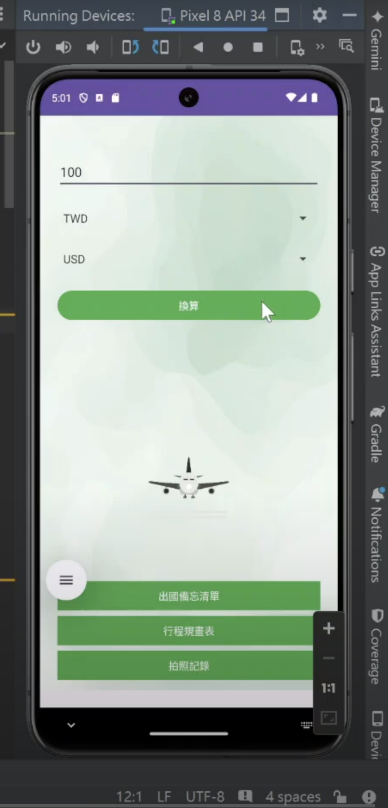
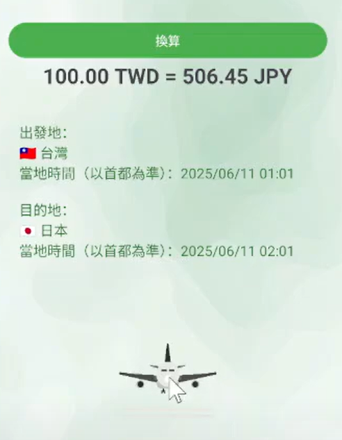
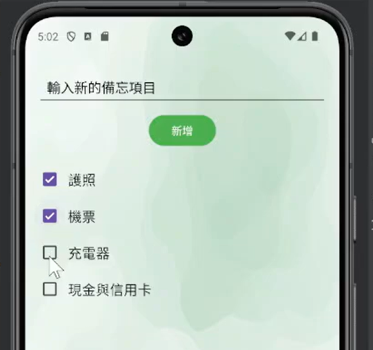
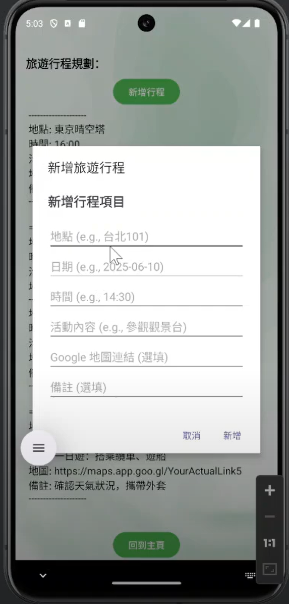

# app專案

## 專案簡介

本專案以 Android Studio (Kotlin) 開發，實作一個整合多功能的行動應用程式。
使用者可透過本 App 進行 匯率換算、查看當地時間，同時還具備 備忘錄勾選清單與 行程規劃新增 功能。
此專案的目的在於熟悉 Android App 開發流程、畫面切換（Activity 與 Intent）、資料儲存（SharedPreferences）及基礎 UI 設計。

專案實際操作影片，可點選下方影片連結。

[](https://youtu.be/MRkJucYJLBc)

---

## 專案功能與內容

- **首頁 (MainActivity.kt)**：進入後提供功能選單，可選擇進入不同功能頁面。



- **匯率換算功能 (ExchangeActivity.kt)**：使用者輸入金額與選擇幣別，即可換算為其他貨幣。

顯示轉換結果並同時顯示「當地目前時間」。

採用 SimpleDateFormat 及 Calendar 取得並顯示當前時間。



- **備忘錄勾選功能 (TodoActivity.kt)**：使用者可新增待辦事項並透過勾選框 (CheckBox) 標示完成狀態。

透過 RecyclerView 呈現列表項目。



- **行程規劃功能 (ScheduleActivity.kt)**：可新增行程項目（日期、內容）。

顯示在清單中，支援新增與刪除操作。

利用 ListView 或 RecyclerView 顯示資料。




---

## 使用技術

- **Android Studio (Kotlin)**：主要開發環境與語言。
- **Android SDK**：使用內建 UI 元件如 EditText、Button、TextView、RecyclerView、CheckBox 等。
- **Activity & Intent 機制**：多頁面切換與資料傳遞。
- **RecyclerView / ListView**：呈現清單型資料。
- **Date 與 Time API**：顯示當地目前時間。

---

## 專案執行方式

開啟 Android Studio。

選擇「Open」匯入本專案資料夾。

連接模擬器或實體裝置。

點選「▶ Run」執行專案。

App 開啟後可選擇不同功能進行操作。

---

## 專案結構
```
  MyApplication/
 ├─ app/
 │   ├─ src/
 │   │   ├─ main/
 │   │   │   ├─ java/com/example/myapplication/
 │   │   │   │   ├─ MainActivity.kt           # 首頁選單
 │   │   │   │   ├─ ExchangeActivity.kt       # 匯率換算與時間顯示
 │   │   │   │   ├─ TodoActivity.kt           # 備忘錄勾選功能
 │   │   │   │   └─ ScheduleActivity.kt       # 行程規劃功能
 │   │   │   └─ res/layout/
 │   │   │       ├─ activity_main.xml
 │   │   │       ├─ activity_exchange.xml
 │   │   │       ├─ activity_todo.xml
 │   │   │       └─ activity_schedule.xml
 │   ├─ build.gradle
 │
 ├─ gradle/
 ├─ build.gradle
 └─ README.md


```
---

## 授權說明
本專案僅供學術用途與作品展示使用。  
若需引用或修改，請標明出處。
